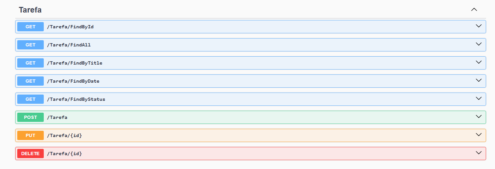

# 📚 Desafio - Lista de Tarefas API 

Esta é uma API desenvolvida em **.NET** que permite o gerenciamento de uma lista de tarefas. Ela foi criada como parte de um desafio prático para reforçar conhecimentos em **ASP.NET Core**, Entity Framework Core e arquitetura de APIs modernas.

---

## 📂 Sumário

- ⚒️ Tecnologias utilizada
- 🔧 Funcionalidades
- 🗄️ Database Modeling
- 🔍 Fazendo Requisições
- 🚀 Como Executar o Projeto
    - 📗 Documentação Swagger
    - 🚫 Observações
  
---

## ⚒️ Tecnologias utilizada

* .NET 8
* ASP.NET Core
* Entity Framework Core
* SQL Server 
* Swagger (para documentação da API)

---

## 🔧 Funcionalidades

* **Criar** uma nova tarefa
* **Buscar** todas as tarefas
* **Buscar** uma tarefa por ID
* **Atualizar** uma tarefa existente
* **Deletar** uma tarefa

---

## 🗄️ Database Modeling


---

## 🔍 Fazendo Requisições 

### 🔵 Obter Por Id

```
GET /api/Tarefa/FindById
```
### 🔵 Obter Todas as Tarefas (GET)

```
GET /api/Tarefa.FindAll
```
### 🔵 Obter Por Titulo

```
GET /api/Tarefa/FindByTitle
```
### 🔵 Obter Por Data

```
GET /api/Tarefa/FindByDate
```
### 🔵 Obter Por Status

```
GET /api/Tarefa/FindByStatus
```
### 🟢 Criar Tarefa (POST)

```json
POST /api/Tarefa
{
  "titulo": "Estudar .NET",
  "descricao": "Aprofundar conhecimento em ASP.NET Core",
  "data": "2025-07-23",
  "status": true
}
```
### 🟠 Atualizar Tarefa (PUT)

```json
PuT /api/Tarefa{id}
{
  "titulo": "Estudar .NET",
  "descricao": "Aprofundar conhecimento em ASP.NET Core",
  "data": "2025-07-23",
  "status": true
}
```
### 🔴 Deletar Tarefa (DELETE)

```
GET /api/Tarefa/{id}
```
---

## 🚀 Como Executar o Projeto

1️⃣. Clone o repositório

```bash
git clone https://github.com/brunopaz8/desafio-lista-de-tarefas-api.git
cd desafio-lista-de-tarefas-api
```

2️⃣. Restaure os pacotes e rode as migrations

```bash
dotnet restore
dotnet ef database update
```

3️⃣. Execute o projeto

```bash
dotnet run
```

A API estará disponível em: `https://localhost:5001` ou `http://localhost:5000`

---

### 📗 Documentação **Swagger**
A API conta com documentação interativa via **Swagger UI**, facilitando testes e visualização dos endpoints. Após iniciar a aplicação, acesse:

🟢 **Swagger UI:** [http://localhost:5226/swagger/index.html](http://localhost:5226/swagger/index.html)

📌 **Exemplo da interface Swagger UI:**


---

## 🚫 Observações

* Certifique-se de configurar corretamente a `connectionString` no `appsettings.json`.
* O projeto está configurado para rodar em modo `Development` por padrão.


